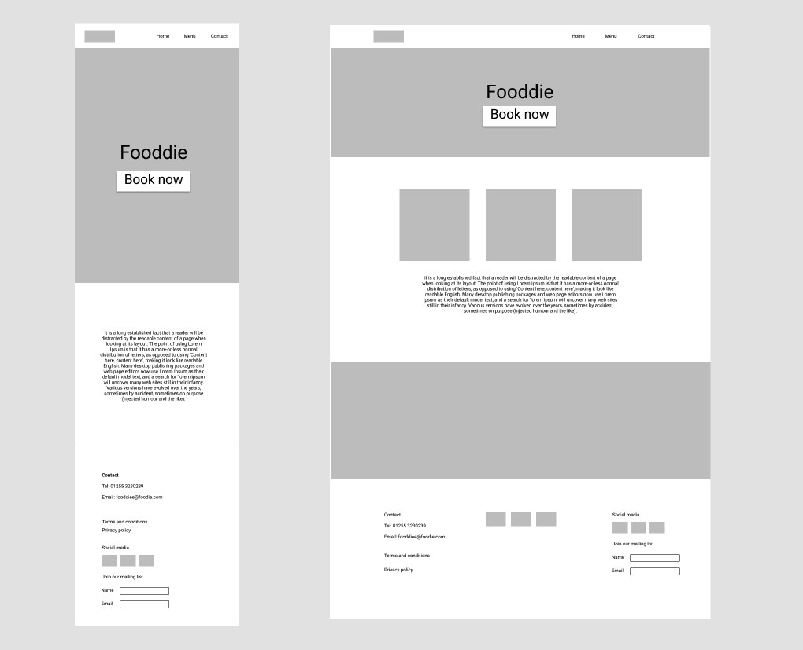

## Background images

Background images let us apply an image to an element using CSS. **Do not confuse them with the img html tag**. Background images are not read by google so are not as good as a img tag in terms of SEO. However sometimes it is easier to acheive certain things with a bacckground image than with the img tag.

To set a background image, do the following:
```
.myElement {
    background-image: url('path/to/image.png');
}
```

you will probably need to set some other properties t make the image appear as you want it:
```
.myElement {
    background-image: url('path/to/image.png');
    background-repeat: no-repeat;
    background-size:cover;
    background-position:center;
}
```
You can learn about all these different properties by searching for them on w3schools or Mozilla.

## Restaurant project

For homework build the homepage of your dummy website. The idea is for you to practise things you have learnt from the first 2 weeks.

The design I did was as below, but feel free to do your own variations.



Here is the skeleton html for you to get started with:
```
<!DOCTYPE html>
<html lang="en">

<head>
    <meta charset="UTF-8">
    <meta http-equiv="X-UA-Compatible" content="IE=edge">
    <meta name="viewport" content="width=device-width, initial-scale=1.0">
    <title>Fooddie restaurant</title>
</head>

<body>

    <header>
        <div class="logo"></div>
        <nav class="main-navigation">
            <ul>
                <li>
                    <a href="index.html">Home</a>
                </li>
                <li>
                    <a href="menu.html">Menu</a>
                </li>
                <li>
                    <a href="contact.html">Contact</a>
                </li>
            </ul>
        </nav>
    </header>

    <main>
        <section class="hero-section">
            <div class="hero-section__inner">
                <h1>Fooddie</h1>
                <button>Book now</button>
            </div>
        </section>
        <section class="intro-section">
            <div class="intro-section__inner">
                <div class="intro-section__food-images"></div>
                <div class="intro-section__text">
                    Lorem ipsum dolor sit amet consectetur adipisicing elit. Molestiae voluptatem repudiandae enim laborum. Incidunt dolorum, aliquid quisquam quia qui molestiae pariatur quod est eligendi delectus nisi obcaecati? Facere, iste incidunt!
                </div>
            </div>
        </section>
        <section class="image-banner">
            <div class="intro-section__inner">
                <a href="contact.html">
                    <h2>Contact us</h2>
                </a>
            </div>
        </section>
    </main>

    <footer>
        <div class="footer-container">

            <div class="column-1"></div>
            <div class="column-2"></div>
            <div class="column-3"></div>

        </div>
    </footer>

</body>

</html>
```

